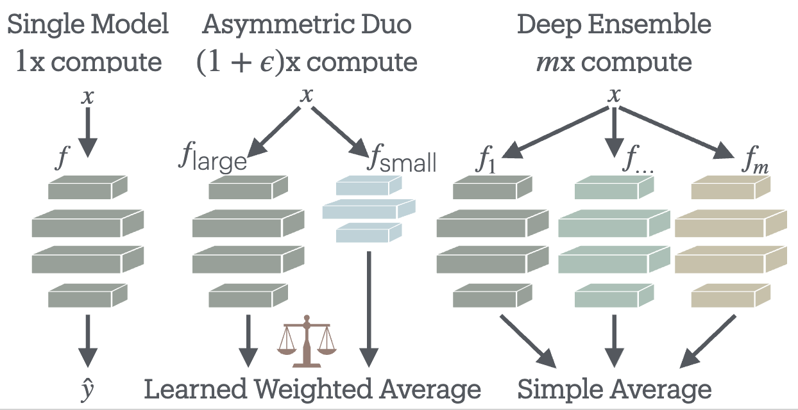
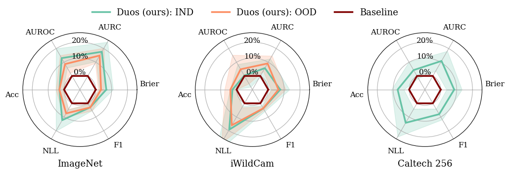

# Asymmetric Duos: Sidekicks Improve Uncertainty

<div align="center">



**NeurIPS 2025 (Spotlight)**

[](https://www.python.org/downloads/)
[](https://pytorch.org/)
[](LICENSE)

</div>

## Overview

This repository contains the official implementation for **"Asymmetric Duos: Sidekicks Improve Uncertainty"**.

We introduce a novel approach to uncertainty quantification by combining two models with asymmetric computational capacities—a large, accurate model paired with a smaller, efficient model (the "sidekick"). 

Our temperature-weighted aggreagation improves both accuracy and uncertainty metrics across datasets and architectures.



---
## Installation

### Install Dependencies
```bash
pip install -r requirements.txt
```

## Project Structure

```
asymmetric-duos/
├── train/                    # Training scripts
│   ├── hp_tune.py           # Hyperparameter tuning with Ray Tune
│   ├── ivon_train.py        # Bayesian training with IVON
│   ├── make_soup.py         # Model ensembling (uniform/greedy soup)
│   └── download_imagenet_models.py
├── evaluate/                 # Evaluation scripts
│   ├── 1_single_model_prediction.py
│   ├── 2_temp_scale.py      # Single model temperature scaling
│   ├── 3_duo_temp_scale.py  # Joint temperature calibration
│   ├── 5_evaluate_duo_predictions.py  # Main duo evaluation
│   └── ...
├── load_models/              # Model loading and wrappers
│   ├── DuoWrapper.py        # Core duo implementation
│   ├── TempScaleWrapper.py
│   └── model_loader.py
├── load_data/                # Data loading utilities
│   ├── datasets.py          # IWildCam and Caltech256 datasets
│   └── dataloaders.py
├── utils/                    # Utility functions
│   ├── uncertainty_metrics.py  # Comprehensive metrics
│   └── calibrate_temperature.py
├── configs/                  # Configuration files
│   ├── duos.csv             # Model duo pairs
│   ├── duos_rn50.csv
│   ├── backbones.csv
│   ├── caltech256.yaml
│   └── iwildcam.yaml
├── assets/                   # Visualizations
│   ├── duo_illustration.png
│   └── radar.png
└── requirements.txt
```

---

## Quick Start

### 1. Train Individual Models

Train models with hyperparameter tuning using Ray Tune:

```bash
python train/hp_tune.py \
    --model convnext_base \
    --dataset iwildcam \
    --num_samples 12 \
    --output_dir ./checkpoints
```

This performs:
- **Linear Probing (LP)**: Freeze backbone, train classification head (4 trials)
- **Fine-Tuning (FF)**: Full model fine-tuning (12 trials)
- **Model Soup**: Creates uniform and greedy soup ensembles

### 2. Generate Predictions

Extract logits and features for evaluation:

```bash
python evaluate/1_single_model_prediction.py \
    --model_path ./checkpoints/convnext_base_best.pth \
    --dataset iwildcam \
    --output_dir ./predictions
```

### 3. Calibrate Temperature

#### Single Model Calibration
```bash
python evaluate/2_temp_scale.py \
    --predictions ./predictions/convnext_base.csv \
    --output_dir ./calibrated
```

#### Duo Joint Calibration
```bash
python evaluate/3_duo_temp_scale.py \
    --large_model_pred ./predictions/convnext_base.csv \
    --small_model_pred ./predictions/efficientnet_b0.csv \
    --output_dir ./calibrated
```

### 4. Evaluate Duo Performance

Run comprehensive evaluation on model duos:

```bash
python evaluate/5_evaluate_duo_predictions.py \
    --config configs/duos.csv \
    --predictions_dir ./predictions \
    --output_dir ./results
```

---

## Datasets

### iWildCam

Camera trap images from the WILDS benchmark:
- **Classes**: 182 species
- **Splits**: train, id_val, id_test, ood_test
- **Domain Shift**: Geographic and temporal distribution shifts

The dataset is automatically downloaded via the `wilds` library.

### Caltech256

Object recognition benchmark:
- **Classes**: 257 object categories
- **Task**: Fine-grained object classification

Configure dataset paths in `configs/iwildcam.yaml` and `configs/caltech256.yaml`.

---

## Training

### Hyperparameter Optimization

We use **Ray Tune** with ASHA scheduling for efficient hyperparameter search. All models receive equal tuning budgets for fair comparison.

**Two-Stage Training:**

1. **Linear Probing (LP)**
   - Freeze pre-trained backbone
   - Train only classification head
   - Search space: Learning rate ∈ [1e-4, 1e-2]
   - Trials: 4

2. **Fine-Tuning (FF)**
   - Fine-tune entire model
   - Search space:
     - Learning rate ∈ [1e-6, 3e-4]
     - Weight decay ∈ [1e-8, 1e-5]
   - Trials: 12 (configurable)
   - Scheduler: Warmup + cosine annealing

## Evaluation

### Metrics

We evaluate models on multiple uncertainty quantification metrics:

**Classification Performance:**
- Accuracy
- Macro F1 Score

**Calibration:**
- Expected Calibration Error (ECE)
- Negative Log-Likelihood (NLL)
- Brier Score

**Uncertainty Quality:**
- CP-AUROC (Correct Prediction AUROC)
- AURC (Area Under Risk-Coverage Curve)
- E-AURC (Excess AURC over oracle)
- SAC (Selective Accuracy at Coverage thresholds)

### Duo Operating Modes

The `DuoWrapper` supports three modes:

1. **Unweighted**: Simple average of logits
   ```
   logits_combined = (logits_large + logits_small) / 2
   ```

2. **UQ-Only**: Use large model predictions with asymmetric uncertainty
   - Predictions from large model
   - Uncertainty combines confidence + inter-model disagreement (KL divergence)

3. **Asymmetric**: Temperature-scaled logits, then averaged
   ```
   logits_combined = (logits_large/T_large + logits_small/T_small) / 2
   ```

---

## Reproduction

To reproduce the full experimental results from the paper:

### Step 1: Train All Models

```bash
# Train base models from configs/backbones.csv
for model in convnext_base resnet50 efficientnet_b0 ...; do
    python train/hp_tune.py --model $model --dataset iwildcam
done
```

### Step 2: Generate All Predictions

```bash
# Extract predictions for all trained models
python evaluate/1_single_model_prediction.py --all_models
```

### Step 3: Calibrate All Duos

```bash
# Joint temperature calibration for all pairs in configs/duos.csv
python evaluate/3_duo_temp_scale.py --config configs/duos.csv
```

### Step 4: Comprehensive Evaluation

```bash
# Evaluate all duos with all metrics
python evaluate/5_evaluate_duo_predictions.py \
    --config configs/duos.csv \
    --modes unweighted uqonly asymmetric
```

---

## Citation

If you find this work useful, please cite:

```bibtex
@inproceedings{asymmetric-duos-2025,
  title={Asymmetric Duos: Sidekicks Improve Uncertainty},
  author={Tim G. Zhou, Evan Shelhamer, Geoff Pleiss},
  booktitle={Advances in Neural Information Processing Systems (NeurIPS)},
  year={2025}
}
```


